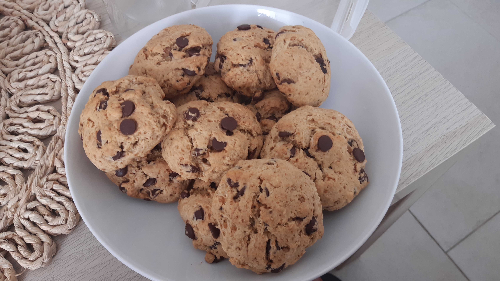

## Sušenky El Morche

### Množství

- asi 15 větších sušenek

### Suroviny
- 300 g hladké mouky
- 1 prášek do pečiva
- 100 g hnědého třtinového cukru
- 100 g chocolate chips (kousků čokolády)
- 100 ml oleje
- cca 50 ml rostlinného mléka

### Postup

1. V misce smícháme mouku s práškem do pečiva, přidáme cukr a kousky čokolády a promícháme. 
2. Přidáme asi 100 ml oleje, zamícháme. 
3. Postupně po lžících přidáváme mléko a mícháme, dokud nevznikne hmota, ze které jdou tvořit sušenky. Hmota by měla být kompaktní, neměla by se drobit, ale rozhodně by neměla být tekutá. 
4. Z hmoty tvarujeme kuličky, které trochu rozplácneme a dáme s dostatečnými rozestupy na plech. 
5. Z tohoto množství by mělo být asi 15 sušenek, vejde se to na jeden plech

